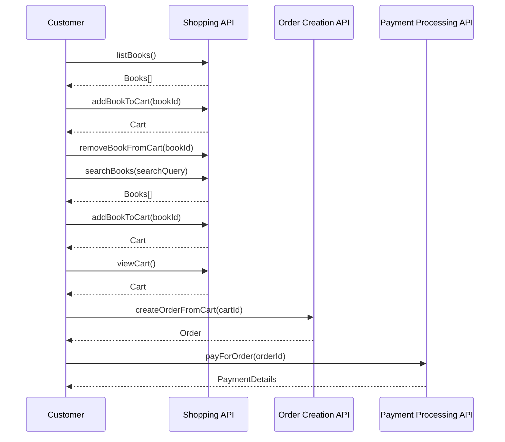
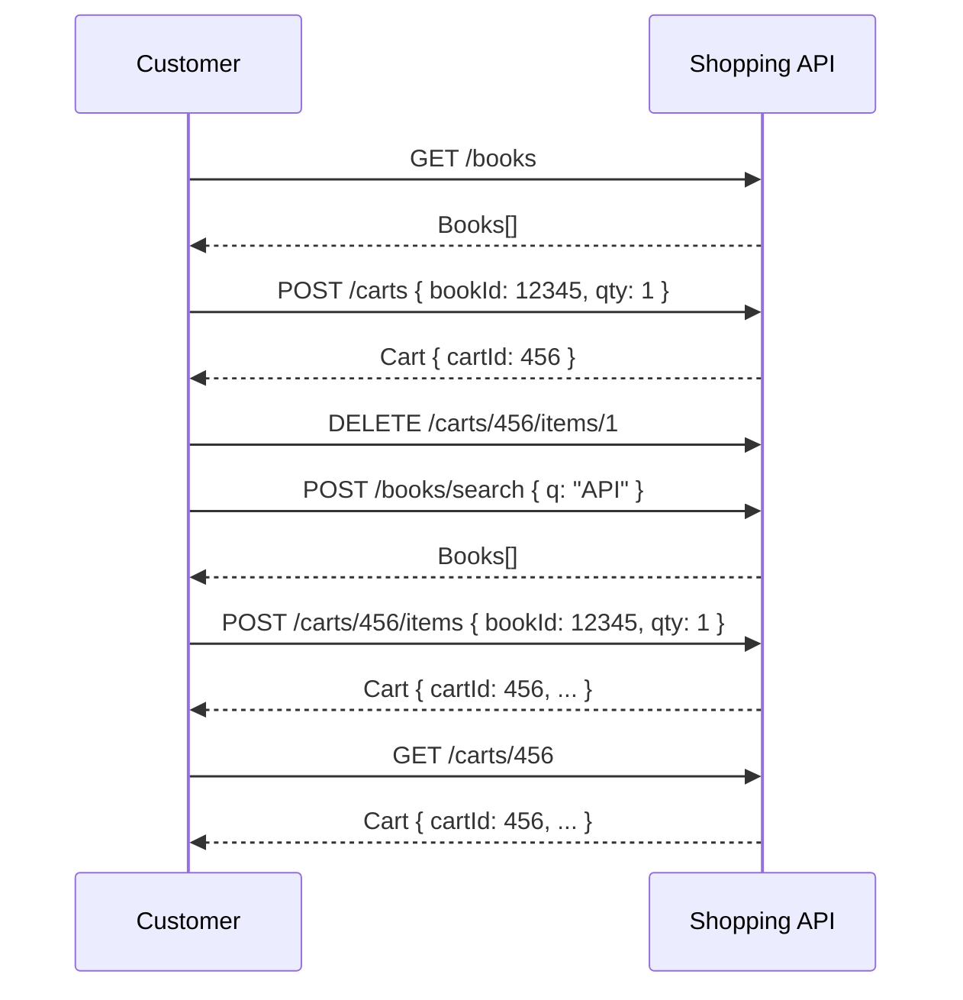

Principais ideias:

* O design de um Produto de API não é uma tarefa trivial. É diferente de quando você está desenvolvendo uma API que você mesmo ou o seu próprio time irá consumir. Se você conhece os padrões de especificação de APIs tais como OpenAPI e AsyncAPI, poderá pensar que isso é tão simples como elaborar essas especificações e obter aprovação para o desenvolvimento. Mas será que é tão simples assim? Estes são alguns dos problemas com os quais pode se deparar:
  1. Como eu sei que minha API está resolvendo os problemas da minha empresa?
  2. Como eu sei que minha API resolverá os problemas dos meus consumidores? Quando uma API não resolve de fato os problemas que ela foi feita para resolver, é provável que caia em desuso e seu projeto fracasse.
  3. Como identificar os recursos que compõem a(s) API(s) e como identificar os limites entre elas? Quando utilizar uma ou várias APIs diferentes, por exemplo?
  4. Infelizmente é muito comum descobrir tarde demais algum ponto da API que não atende da melhor forma os consumidores, portanto falhas na sua API. Tendo isso em vista, como posso mitigar a possiblidade de retrabalho durante todo o fluxo de entrega da API, já que isso impacta bastante o tempo de entrega, é algo que queremos evitar o máximo possível, certo?
  5. Como paralelizar o trabalho com os times consumidores, para que a solução como um tudo para o problema da empresa possa ser desenvolvida o mais rápido possivel, eliminando ao máximo qualquer possível overhead de comunicação intra-times?
  
Atualmente trabalho em um time responsável por projetar e desenvoler APIs altamente estratégicas para a nossa organização. Além disso, a empresa tem passado por algumas transformações e almejado certos objetivos que tornam críticas necessidades como a eliminação de desperdício de recursos e velocidade de entrega (que se você parar pra pensar, são questões de produtividade importantes a qualquer empresa, a qualquer momento), então essas perguntas se tornaram essenciais pra mim. 

Minha empresa também tem passado por uma jornada de adesão ao DDD, Domain Driven Design, então tive que aprender e rever conceitos de DDD muito rapidamente. O Livro "Aprenda Domain-driven Design: Alinhando Arquitetura de Software e Estratégia de Negócios", que deverá ganhar um post aqui em algum momento, foi fundamental na minha jornada de aprendizado em DDD, é um livro fantástico, extremamente didático. O autor desse livro recomendou um livro sobre design de APIs, que é o livro que está na descrição desse post. Vi nesse livro a oportunidade de achar respostas para as minhas perguntas e receios.

E de fato, as achei. A ideia central do livro é expor um processo bem estruturado de Design de APIs, orientado à resolução concreta dos problemas da organização, e casa muito bem com uma abordagem DDD. Então, respondendo as perguntas acima, no formato de insights, aqui vai:

> **Insight 1**: Alinhe as necessidades de negócio com todas as partes interessadas - negócio, times consumidores, clientes etc., e registre os casos de uso em um formato que foca nos problemas do cliente, e não necessariamente nos atores envolvidos, como as **Estórias de Trabalho**. Cada estória de trabalho revela uma "Digital Capability" que o negócio precisa que você construa.

Esse é o começo de tudo. A partir daí você irá capturar cada **atividade** e **passos de atividade** que compõem cada uma das *digital capabilities*. Às vezes uma capability não é tão complexa ao ponto de ser composta por várias atividades e passos de atividade, mas às vezes a decomposição se torna fundamental para o entendimento de complexidades à primeira vista ocultas.

> **Insight 2**: A partir do que foi levantado anteriormente, encadeie a construção de uma sequência incremental de artefatos que possibilitarão, de modo estruturado e apoiado por feedback das partes interessadas, a identificação das diferentes APIs que você precisará criar, das operações que suas APIs precisarão suportar, dos recursos expostos por essas APIs e a taxonomia entre eles, e todos os detalhes das interfaces públicas dessas APIs (entradas, saídas síncronas e eventos).

O segundo insight é sobre a importância de se seguir uma sequência de passos que você pode e deve realizar antes de chegar na especificação de suas APIs.

Acho que foge do escopo desse post abordar e resumir cada um desses pontos em detalhes. O nome desse processo é ADDR (acronimo para Align, Defin, Design and Refine). Você pode obter um resumo de cada etapa no website: (https://addrprocess.com/), mas realmente recomendo a leitura caso você planeje aplicar o processo em breve. Esse livro também pode ser bem aproveitado por pessoas sem uma grande bagagem técnica - por exemplo, por pessoas que vem de negócios e estão tendo que trabalhar na gestão de produto de uma API.

De qualquer forma, eu concentrei (adaptando pouca coisa) os artefatos de exemplos que o livro traz e algumas anotações sobre cada fase do processo, para minha própria conveniência. Compartilho aqui caso seja útil para você também.

O autor ressalta que é possível entregar APIs sem seguir um processo estruturado. Somos Engenheiros de Software, nós damos conta do recado. Mesmo que isso custe longas horas extras que se acumulam principalmente na reta final dos projetos. A questão é que ter um método estruturado nos ajuda a ter segurança de que realmente alcançaremos o objetivo, e reduz bastante a probabilidade de acabarmos descobrindo a nacessidade de mudar algo tarde demais.

Abaixo centralizo os artefatos de exemplo de cada fase e estágio do processo, considerando um design de uma API Rest. Todos esses exemplos foram extraídos do [repositório](https://github.com/launchany/align-define-design-examples/) do livro.

## ALIGN

### 1. Estórias de Trabalho / Identificação das Digital Capabilities

| Job Story ID | When... (Triggering Situation)                                            | I want to...    (Digital Capability)  | So I can...    (Outcome)                                    |
|--------------|---------------------------------------------------------------------------|---------------------------------------|-------------------------------------------------------------|
| 1            | I want to see the new books that have been released                       | List recently added books             | Keep up with the latest   watercooler talk                  |
| 2            | I want to find a book that will be entertaining or teach me something new | Search for a book by topic or keyword | Browse related books                                        |
| 3            | I encounter an unfamiliar book                                            | View a book’s details and reviews     | Determine if the book is of interest to me                  |
| 4            | I find one or more books that I wish to buy                               | Place an order                        | Buy the books and have them shipped to my preferred address |
| 5            | I am uncertain of when my order will arrive                               | View the status of an order           | Confirm the date that the order will arrive                 |

### 2. Atividades e Passos de Atividade

| Digital Capability | Activity         | Participants          | Description                                                         |
|--------------------|------------------|-----------------------|---------------------------------------------------------------------|
| Place an Order     | Browse for Books | Customer              | Browse or search for books                                          |
| Place an Order     | Shop for Books   | Customer, Call Center | A customer adds books to a cart                                     |
| Place an Order     | Create an Order  | Customer, Call Center | A customer places the order using the contents of the shopping cart |

| Digital Capability | Activity         | Activity Step          | Participants          | Description                                   |
| ------------------ | ---------------- | ---------------------- | --------------------- | --------------------------------------------- |
| Place an Order     | Browse for Books | List Books             | Customer, Call Center | List books by category or release date        |
| Place an Order     | Browse for Books | Search for Books       | Customer, Call Center | Search for books by author, title             |
| Place an Order     | Browse for Books | View Book Details      | Customer, Call Center | View the details of a book                    |
| Place an Order     | Shop for Books   | Add Books to Cart      | Customer, Call Center | Add a book to the customer's cart             |
| Place an Order     | Shop for Books   | Remove Books from Cart | Customer, Call Center | Remove a book from the customer's   cart      |
| Place an Order     | Shop for Books   | Clear Cart             | Customer, Call Center | Remove all books from the customer's cart     |
| Place an Order     | Shop for Books   | View Cart              | Customer, Call Center | View the current cart and total               |
| Place an Order     | Create an Order  | Checkout               | Customer, Call Center | Create an order from the contents of the cart |
| Place an Order     | Create an Order  | Pay for Order          | Customer, Call Center | Accept and process payment for the order      |

## DEFINE

### 3. Identificação dos Limites entre APIs

> Look for shifts in language (...). Often, the activity step names and/or descriptions have a basic sentence structure with nouns and verbs. Make note of where the nouns shift in the activity steps. The nouns acted upon may offer clues to where boundaries exist. When steps shift to a new set of nouns, mark the location and use it as the starting point of a new boundary.

> Next, the boundary is given a name to represent the API that will be designed.

Capability, atividade e passos de atividade são agrupados em APIs (ou subdomínios/bounded contexts, se a organização já segue DDD). Exemplos: API de Compras (vai até o antepenultimo passo descrito na tabela 1.3.), API de Criação de Pedido (penúltimo passo da tabela 1.3.) e API de Pagamento (último passo da tabela 1.3.).

### 4. Modelagem de Perfis de APIs

> API modeling is a tracer bullet for API design

> Api modeling uses job stories, activities and activity steps as inputs to produce a coheseve view of each API, called an _API profile_. An API profile captures characteristics about the API, including its name, scope, operations, and emitted events that will be used to deliver desired outcomes. 

#### 4.1. Sumário de Perfil de API

**Exemplo: Shopping API**

* Supports the book browsing experience and cart management
* Scope: Public

| Operation Name       | Description                               | Participants          |
| -------------------- | ----------------------------------------- | --------------------- |
| listBooks()          | List books by category or release date    | Customer, Call Center |
| searchBooks()        | Search   for books by author, title       | Customer, Call Center |
| viewBook()           | View book details                         | Customer, Call Center |
| addBookToCart()      | Add a book to the customer's cart         | Customer, Call Center |
| removeBookFromCart() | Remove a book from the customer's cart    | Customer, Call Center |
| clearCart()          | Remove all books from the customer's cart | Customer, Call Center |
| viewCart()           | View the current cart and total           | Customer, Call Center |

#### 4.2. Identificação de Recursos

> Recursos são frequentemente entidades de domínio sobre as quais a API opera.

**Exemplo: Modelagem de Recursos da API de Compras**

##### Book
| Property Name | Description                   |
|---------------|-------------------------------|
| title         | The book title                |
| isbn          | The unique ISBN of the book   |
| authors       | List of Book Author resources |

##### Book Author
| Property Name | Description                 |
|---------------|-----------------------------|
| fullName      | The full name of the author |

##### Cart
| Property Name | Description                                  |
|---------------|----------------------------------------------|
| cartItems     | The items currently in the cart for purchase |
| subtotal      | The total cost of all books in the cart      |
| salesTax      | The sales tax to be applied                  |
| vatTax        | Any VAT tax to be applied                    |
| cartTotal     | The total cost of the cart                   |

#### 4.3. Identificação da Taxonomia dos Recursos

Três relacionamentos possíveis: Independente, Dependente e Associativo. A identificação de relacionamentos associativos frequentemente leva à descoberta de um recurso associativo correspondente, com suas próprias propriedades descrevendo detalhes da relação.

##### Exemplo: API de Compras

* Recurso de Carrinho tem relação associativa com recurso de Livro.
* O que leva a descoberta de um novo recurso: Item de Carrinho. Esse item é dependente do recurso carrinho, mas é independente do recurso de Livro.
* O Recurso de Livro é independente do Recurso de Autor de Livro.

###### Cart Item
| Property Name | Description                                                                       |
|---------------|-----------------------------------------------------------------------------------|
| book          | The books currently in the cart for purchase                                      |
| qty           | The quantity of the item in the cart (default 1)                                  |
| unitPrice     | The unit price represented as a whole number. For example, $1.99 USD would be 199 |

#### 4.4. Adição de Eventos e Expansão dos Detalhes da Operação

##### Exemplo: API de Compras

| Operation Name       | Description                               | Participants          | Resource(s)       | Emitted Events   | Operation Details                                                          | Traits                     |
|----------------------|-------------------------------------------|-----------------------|-------------------|------------------|----------------------------------------------------------------------------|----------------------------|
| listBooks()          | List books by category or release date    | Customer, Call Center | Book, Book Author | Books.Listed     | __Request Parameters:__ categoryId, releaseDate     __Returns:__   Books[] | safe   / synchronous       |
| searchBooks()        | Search   for books by author, title       | Customer, Call Center | Book              | Books.Searched   | __Request Parameters:__ searchQuery     __Returns:__   Books[]             | safe   / synchronous       |
| addItemToCart()      | Add a book to the customer's cart         | Customer, Call Center | Cart Item, Cart   | Cart.ItemAdded   | __Request Parameters:__ cartId, bookId,   quantity     __Returns:__   Cart | unsafe   / synchronous     |
| removeItemFromCart() | Remove a book from the customer's cart    | Customer, Call Center | Cart Item, Cart   | Cart.ItemRemoved | __Request Parameters:__ cartItemId     __Returns:__   Cart                 | idempotent   / synchronous |
| clearCart()          | Remove all books from the customer's cart | Customer, Call Center | Cart              | Cart.Cleared     | __Request Parameters:__ cartId     __Returns:__   Cart                     | safe / synchronous         |
| viewCart()           | View the current cart and total           | Customer, Call Center | Cart              | Cart.Viewed      | __Request Parameters:__ cartId     __Returns:__   Cart                     | safe / synchronous         |

#### 4.5. Validação da Modelagem com Diagramas de Sequência para Cenários de uso típicos

#### 4.6. Avaliação de prioridade de API, possibilidade Reuso ou utilização de produtos de prateleira

| Perfil de API                      | Valor Competitivo e de Negócio | Esforço de Construção Interna | APIs existentes Internas/De Terceiros                                                                                                |
|------------------------------------|--------------------------------|-------------------------------|--------------------------------------------------------------------------------------------------------------------------------------|
| API de Compras                     | Médio                          | Médio                         | Soluções de terceiros para ecommerce (alta complexidade para personalizar e adicionar suporte ao nosso motor interno de recomendação |
| API de Criação de Pedidos          | Médio                          | Médio                         | APIs de terceiros para processamento de pedidos (podem incluir suporte a realização também)                                          |
| API de Processamento de Pagamentos | Pequeno                        | Alto                          | Vários processadores de pagamento de terceiros                                                                                       |

## DESIGN

### 5. High Level Design: REST

#### 5.1. REST: Desenho de Caminhos de URL para Recursos

| Caminho de Recurso    | URLs                  |
| --------------------- | --------------------- |
| Livros                | /books                |
| Autores de Livros     | /authors              |
| Carrinhos             | /carts                |
| ` ` Items de Carrinho | /carts/{cartId}/items |

| Caminho de Recurso                 | Operation Name       | HTTP Method | Description                               | Request                 | Response   |
| ---------------------------------- | -------------------- | ----------- | ----------------------------------------- | ----------------------- | ---------- |
| /books                             | listBooks()          |             | List books by category or release date    | categoryId, releaseDate | Books[]    |
| /books/search                      | searchBooks()        |             | Search   for books by author, title       | searchQuery             | Books[]    |
| /books/{bookId}                    | viewBook()           |             | View book details                         | bookId                  | Book       |
| /carts/{cartId}                    | viewCart()           |             | View the current cart and total           | cartId                  | Cart       |
| /carts/{cartId}                    | clearCart()          |             | Remove all books from the customer's cart | cartId                  | Cart       |
| /carts/{cartId}/items              | addItemToCart()      |             | Add a book to the customer's cart         | cartId                  | Cart       |
| /carts/{cartId}/items/{cartItemId} | removeItemFromCart() |             | Remove a book from the customer's cart    | cartId, cartItemId      | Cart       |
| /authors                           | getAuthorDetails()   |             | Retrieve the detail's of an author        | authorId                | BookAuthor |

#### 5.2. Mapeamento de operações de API para Métodos HTTP

#### 5.3. Atribuição de Códigos de Resposta

| Caminho de Recurso                 | Operation Name       | HTTP Method | Description                               | Request Details         | Response Details | Response Code(s) |
| ---------------------------------- | -------------------- | ----------- | ----------------------------------------- | ----------------------- | ---------------- | ---------------- |
| /books                             | listBooks()          | GET         | List books by category or release date    | categoryId, releaseDate | Books[]          | 200              |
| /books/search                      | searchBooks()        | POST        | Search   for books by author, title       | searchQuery             | Books[]          | 200              |
| /books/{bookId}                    | viewBook()           | GET         | View book details                         | bookId                  | Book             | 200, 404         |
| /carts/{cartId}                    | viewCart()           | GET         | View the current cart and total           | cartId                  | Cart             | 200, 404         |
| /carts/{cartId}                    | clearCart()          | DELETE      | Remove all books from the customer's cart | cartId                  | Cart             | 204, 404         |
| /carts/{cartId}/items              | addItemToCart()      | POST        | Add a book to the customer's cart         | cartId                  | Cart             | 201, 400         |
| /carts/{cartId}/items/{cartItemId} | removeItemFromCart() | DELETE      | Remove a book from the customer's cart    | cartId, cartItemId      | Cart             | 204, 404         |
| /authors                           | getAuthorDetails()   | GET         | Retrieve the detail's of an author        | authorId                | BookAuthor       | 200, 404         |

#### 5.4. Documentação do Design da API: OAS e Async API

##### API de Compras
https://github.com/launchany/align-define-design-examples/blob/main/bookstore/3a-design-rest/Shopping-API-REST.oas3.yaml

##### API de Criação de Pedido
https://github.com/launchany/align-define-design-examples/blob/main/bookstore/3a-design-rest/Order-Creation-API-REST.oas3.yaml

##### Validação do Design através de Diagramas de Sequência

#### 5.5. Compartilhe e Colete Feedback

### 5.2. Seleção de um Formato de Representação

Quatro possibilidades: Serialização de Recurso, Serialização de Hipermídia, Mensageria de Hipermídia e Mensageria de Hipermídia Semântica.

## REFINE

### 6.1. Decomposição em Bounded Contexts (Ou Microserviços)

#### Exemplo 1: Book Search Service (Microservice Canvas)
![[Pasted image 20250426110826.png]]
Obs: Para organizações já embarcadas nos princípios do DDD, pode-se usar um Bounded Context Canvas em vez deste acima.
### 6.2. Melhorando a Experiência de Desenvolvimento

#### 6.2.1. Criação de Mocks / Protótipo
#### 6.2.2. Criação Bibliotecas Utilitárias e SDKs
#### 6.2.3. Criação de Aplicações de Linha de Comando (CLI) para APIs

### 7. Documentação da API

#### 7.1. Open API.
#### 7.2. Exemplos de Código.
#### 7.3. Exemplos de Workflow.
#### 7.4. Exemplos de Casos de Erro e Prontos para Produção
#### 7.5. Portal do Desenvolvedor

#### 7.6. Feedback

> It is important to engage in conversations with them whenever possible. Engaging in discussions with API consumers will lead to those critical "aha!" moments that API providers need to iprove their documentation.

* **Como sua API resolve meus problemas?**
* **Qual problema cada operação de API suporta?**
* **Como faço para começar a usar a API?**